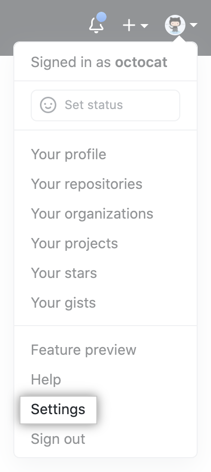
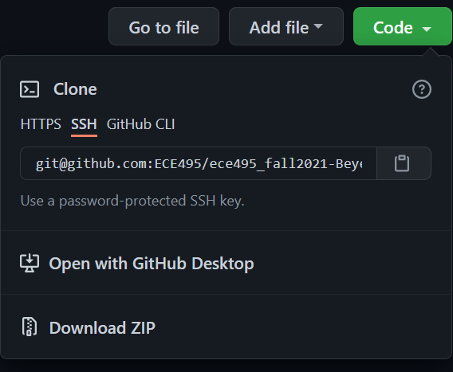

# Intro & GIT

### Lesson Objectives

   1. Learn fundamental concepts of ROS.
   2. Setup GIT repositories on both the master and the robot.
    
### Agenda

   1. Syllabus review.
   2. ROS overview.
   3. Setting up GIT repositories.
    
## 1. Setting up GIT repositories.

### 1.1 Create a repo within the GitHub Classroom:

   1. Browse to [github.com](https://www.github.com)  and create a GitHub account if you do not already have one. It is useful if your username is something that identifies you (e.g. bneff1013).
   
   2. **One student per group** do the following on your personal computer:
       
       (a) Browse to [https://classroom.github.com/a/woMT5_c1](https://classroom.github.com/a/woMT5_c1).
       
       (b) Select "Accept this assignment"
       
       (c) You may need to hit refresh, but eventually it will provide you a link to the repository.
       
       (d) Browse to your repository.
       
       (e) Note the url for your repository (save this link, it is the best way to check if your repo is updated).
       
       (f) Go to Settings -> Manage access -> and "Invite teams or people".
       
       (g) Provide access to your team member using their GitHub user name.
       
       (h) Browse to [https://classroom.github.com/a/58EyOwaM](https://classroom.github.com/a/58EyOwaM) and repeat steps b-g.

### 1.2 Enable SSH connection to your GitHub account:

   1. Open a terminal on your master (ctrl+alt+t).
   
   2. The same student as step 1.1.2 do the following:
   
       (a) Generate a new SSH key by running the below code in the terminal, substituting your GitHub email address:
       
       ```bash
           ssh−keygen −t ed25519 −C "your_email@example.com"
       ```
       
       (b) When you're prompted to "Enter a file in which to save the key," click enter.
       
       (c) At the prompt, type a secure passphrase.
       
       (d) Start the ssh-agent in the background and add your SSH private key to the ssh-agent:
       
       ```bash
           eval "$(ssh−agent −s)"
       ```
       then
       
       ```bash
           ssh−add ∼/.ssh/id_ed25519
       ```
       
       (e) Open the public key:
       
       ```bash
           nano ∼/.ssh/id_ed25519.pub
       ```
       
       (f) Select the contents of the file (maximize the window and ensure it has your GIT email at the end), right click, and select copy.
       
       (g) Open a web browser and sign in to your GitHub account.
       
       (h) In the upper-right corner of any page, click your profile photo, then click **Settings**
       
       
       
       (i) In the user settings sidebar, click **SSH and GPG keys**.
       
       
       
       (j) Click **New SSH key**
       
       
       
       (k) In the "Title" field, add a descriptive label for the new key, such as "MasterX".
       
       (l) Paste your key into the "Key" field (contents of the .pub file).
       
       (m) Click **Add SSH key**.
       
       (n) If prompted, confirm your GitHub password.
       
       (o) Create a SSH connection to your Robot (password is dfec3141):
       
       ```bash
           ssh pi@robotX
       ```
       
       (p) Repeat steps a-f on your robot and j-n on your master.

### 1.3 Clone repository to your master:

   1. On the **master**, open the master GitHub repository and copy your repo address using the SSH mode:
   
   
   
   2. Open a terminal and browse to your workspace source folder:
   
   ```bash
           cd ∼/master_ws/src/
   ```
   
   3. Clone your repo using the username and password used when you generated the SSH key, replacing **USERNAME** with your GitHub username:
   
   ```bash
           git clone git@github.com:ECE495/ece495_master_spring2022−
USERNAME.git
   ```
   
   4. Update your git email address and the last name for you and your team mate.
   
   ```bash
           git config −−global user.email "you@example.com"
   ```
   
   and
   
   ```bash
           git config −−global user.name "Lastname1 Lastname2"
   ```
   
### 1.4 Clone repository to your robot:

   1. Create a secure shell connection to your robot:
   
   ```bash
           ssh pi@robotX
   ```
   
   2. Ensure you are in the ROS robot workspace src directory.
   
   ```bash
           cd robot_ws/src
   ```
   
   3. Clone the robot repository:
   
   ```bash
           git clone git@github.com:ECE495/ece495_robot_spring2022−
USERNAME.git
   ```
   
   4. Update your git email address and the last name for you and your team mate.
   
   ```bash
           git config −−global user.email "you@example.com"
   ```
   
   and
   
   ```bash
           git config −−global user.name "Lastname1 Lastname2"
   ```
   
### 1.5 Repository Management:

:::{note}
**IMPORTANT** 

It is vital that you **ALWAYS** pull when you start working on your code on one system and ALWAYS push when you are done working on your code on that system.

**MEMORIZE THESE STEPS**
:::

   1. Pull your repo on the master (from ece495_master_spring2022-USERNAME folder):
   
   ```bash
           git pull
   ```
   
   2. Complete work on the master. For example, accomplish the following:
   
       (a) Create a file in your repo (from the ece495_master_spring2022-USERNAME folder)
       
       ```bash
           touch README.md
       ```
       
       and
       
       ```bash
           nano README.md
       ```
       
       (b) Copy the following to the file completing with your own information:
       
       ```bash
           # ECE495 Fundamentals of Robotics
           ## Master System
           This repository stores all code for the master computer
           
           ### Team Member 1
           Name:
           Go by name:
           Hometown:
           Desired AFSC:
           Clubs/IC Sports:
           ### Team member 2
           Name:
           Go by name:
           Hometown:
           Desired AFSC:
           Clubs/IC Sports:
       ```
       
       (b) Hit 'ctrl+s' then 'ctrl+x' to save and exit the editor.
   
   3. Add the files that will be uploaded to your repository:
   
   ```bash
           git add −A
   ```
   
   4. Commit your changes to the repository with a message:
   
   ```bash
           git commit −m "Completed README on the master!"
   ```
   
   5. Push your changes to the repository:
   
   ```bash
           git push
   ```
   
   6. Pull your repo on the robot
   
   ```bash
           git pull
   ```
   
   7. Complete work on the robot. For example, accomplish the following:
   
       (a) Create a file in your repo (from the ece495_robot_spring2022-USERNAME folder)
       
       ```bash
           touch README.md
       ```
       and
       
       ```bash
           nano README.md
       ```
       
       (b)
       
       ```bash
           # ECE495 Fundamentals of Robotics
           ## Master System
           This repository stores all code for the master computer
           
           ### Team Member 1
           Name:
           Go by name:
           Hometown:
           Desired AFSC:
           Clubs/IC Sports:
           ### Team member 2
           Name:
           Go by name:
           Hometown:
           Desired AFSC:
           Clubs/IC Sports:
       ```
       
       (c) Hit 'ctrl+s' then 'ctrl+x' to save and exit the editor.
       
   8. Add the files that will be uploaded to your repository:
   
   ```bash
           git add −A
   ```
   9. Commit your changes to the repository with a message:
   
   ```bash
           git commit −m "Completed README on the robot!"
   ```
   10. Push your changes to the repository:
   
   ```bash
           git push
   ```
   
:::{note}
**BOTTOM LINE**: Ensure you pull changes, make edits, and push your changes **EVERY TIME** you work on the master or robot!
:::


> ⚠️ **Checkpoint: Show the instructor both repositories with READMEs on the GitHub website.**

## 2. Assignments.

   - If you got your repo set up on both the master and the robot, then you are good to go!

## 3. Next Time.

   - Module 1 - ROS
