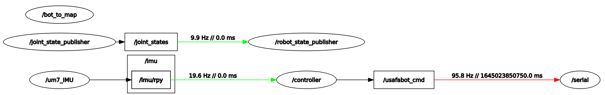

# Launch Files
---

## Purpose
Large applications in robotics typically involve several interconnected ROS nodes, each of which have many parameters. Your current setup is a good example: as you experienced in the IMU lab, you had to open 4 different terminals to run all of the nodes necessary for our system to that point:

**Robot:**
- usafabot/usafabot_serial.py
- um7/um7_driver

**Master:**
- roscore
- lab2/controller.py

This problem is only going to get more complex as we add additional functionality to our robot. As it stands right now, every node requires a separate terminal window and the associated command to run it. Using the *roslaunch* tool, we can eliminate that administrivia of running each node separately. We will create/edit two launch files to bring up the nodes on the master and robot.

## [roslaunch](http://wiki.ros.org/roslaunch)
The *roslaunch* tool is used to launch multiple ROS nodes locally and remotely via SSH. While it is possible to launch nodes remotely, it becomes challenging when there are parameter or other launch files on a remote system, so we will create a separate launch file for the master and the robot. We can run nodes that we have created, nodes from pre-built packages, and other launch files. The roslaunch tool takes in one or more XML configuration files (with the .launch extension) that specify the parameters to set and nodes to launch.

A launch file is an XML document which specifies:
- which nodes to execute
- their parameters
- what other files to include

An XML file stands for Extensible Markup Language (XML). This is a markup language that defines a set of rules for encoding documents in a format that is both human-readable and machine-readable. That isn't necessarily important for this class, but you can read about XML on Wikipedia if you are interested.

We will then use a tool embedded within ROS called *roslaunch* to easily launch multiple nodes or even other launch files.

By convention, we will give our launch files the *.launch* extension and store them in a *launch* folder within our package. This isn't required, but it is the common convention.

## Current State
In this section we will first use the conventional technique to bring up all of the nodes required for **Lab 2** using the currently understood techniques.

Open a new terminal on your **Master** and start *roscore*:

```bash
roscore
```

Notice, running **roscore* now monopolized that terminal and you can no longer use it for anything else.

Open a new terminal or tab on your **Master** and run the **controller.py** node:

```bash
rosrun lab2 controller.py
```

At this point we are done with the master. We only needed to bring up two terminals, however, this is still a relatively simple system in teh grand scheme of things.

> 📝️ **Note:** We did need to keep the terminal with the **controller.py** node open so we can enter commands.

We can now transition to the robot and bring up the required nodes.

Open a new terminal window on the **Master** and use SSH to create a secure shell into the **Robot**:

```bash
ssh pi@robotX
```

Utilize the SSH instance to start the **usafabot_serial.py** node:

```bash
rosrun usafabot usafabot_serial.py
```

Open a new terminal tab on the **Master** and use SSH to create a secure shell into the robot.

Utilize the SSH connection to start the **um7_driver** node:

```bash
rosrun um7 um7_driver _port:=/dev/ttyACM0
```

> 📝️ **Note:** We needed to include and additional parameter for this node to specify the port for the um7 IMU. You will need ot use the port for your particular robot (did you write down the command to display the serial ports from ICE 6?)

Overall you needed 4 terminal windows, including two SSH connections, to bring up this relatively simple system of sensors.

Kill all nodes and roscore.

## roslaunch on the Robot
Navigate to one of the terminals with a secure shell connection to the robot.

Open the *robotics.launch* file:

```bash
rosed usafabot robotics.launch
```

At this time, the *robotics.launch* file includes everything you need to run the robot and more. Let's talk about each line of the file:

```xml
<?xml version="`.0?>
```

This line is the XML prolog, which is optional, but enables editors to include proper formatting for an XML file since the extension of a launch file is *.launch* instead of *.xml*.

```xml
<launch>
    ...
</launch>
```

Every launch file opens and closes with the *launch* root element.

```xml
<!-- A urdf file describes the physical configuration of the robot for simulation -->
<param name="robot_description" command="$(find xacro)/xacro '$(find usafabot_description)/urdf/usafabot.urdf.xacro'"/>	

<!-- A transform that enables rviz to visualize the robot -->
<node name="bot_to_map" pkg="tf2_ros" type="static_transform_publisher" args="0 0 0 0 0 0 map base_footprint" />

<!-- Publish robot states -->
<node name="robot_state_publisher" pkg="robot_state_publisher" type="robot_state_publisher" />

<!-- Publish joint transforms -->
<node name="joint_state_publisher" pkg="joint_state_publisher" type="joint_state_publisher" />
```

These params/nodes are used when visualizing the robot in *rviz* and *Gazebo* and provide simulation and navigation capabilities compatible with other ROS packages. Leave them in case you want to use them in future projects. The first line is a comment. If you are interested in learning more about these nodes, see one of your instructors for more details.

```xml
<!-- Node to send commands to robot and gets wheel speeds from robot -->
<node name="serial" pkg="usafabot" type="usafabot_serial.py" />

<!-- start the um7 IMU node setting correct port -->
<node name="um7_IMU" pkg="um7" type="um7_driver">
<param name="port" type="string" value="/dev/ttyACM1" />
</node>

<!-- make a call to the um7 service to reset gyros, EKF, mag_ref --> 
<node pkg="rosservice" type="rosservice" name="reset" args="call --wait /imu/reset true true true"/>

<!-- call the rplidar launch file -->
<!--
<include file="$(find usafabot)/launch/include/rplidar.launch" />
-->
```

The above are the nodes we will use in this course along with one call to a ROS service. Each node includes an opening and closing tag. If there are no parameters (*usafabot_serial.py*), the tags are `<node` and `/>`. If there are parameters (*um7_driver*) then you must use the name of the closing element: `<node` and `</node>. Pay attention to this formatting as it has tripped up students in the past. After the opening tag is the name of the node, the package where it is located, and the name of the executable file.

> 📝️ **Note:** The parameter used in the *um7_driver* node sets the port to connect to the IMU. If your IMU is not connecting you must update the port name in the launch file.

After the *um7_driver* node is a call to the same service we used during ICE6 to reset the gyros, EKF, and mag_ref. We will no longer need to call the service within the **controller.py** node.

The last line, currently commented out, demonstrates how to launch another launch file. You will use the LIDAR launch file in **Lab 3**.

Close the editor: `ctrl+x`

Take a moment to look at the rplidar launch file:

```bash
rosed usafabot rplidar.launch
```

You will not the launch file is running a single node with a number of parameters. We will discuss these in more details next lab.

Close the editor: `ctrl+x`

## roslaunch on the Master
Navigate to your **lab2** package on the **Master** and create a launch directory:

```
roscd lab2
mkdir launch
cd launch
touch lab2.launch
```

Open the launch file to edit (I recommend using Thonny).

Now we are going to edit the launch file to bring up the **controller.py** node on the **Master**. 

> 📝️ **Note:** *roslaunch* will look to see if *roscore* is started. If it is not, it will automatically run *roscore*.

Add the following to the **lab2.launch** file

```xml
<?xml version="1.0"?>
<launch>
	<!-- node to correlate sensor data and send commands to USAFABot -->
	<node 
		name="controller" pkg="lab2" type="controller.py"
		output="screen" launch-prefix="xterm -e"
	/>
</launch>
```

> 📝️ **Note:** Remember earlier how we reminded you that we need to keep the terminal available for the controller to type commands. By using the two additional parameters *screen* and *launch-prefix*, we can ensure the terminal is available for use.

Save and close the launch file.

## Running Launch Files
Browse to a terminal on the **Master** and make and source your workspace:

```bash
cd ~/master_ws
catkin_make
source ~/.bashrc
```

Utilize the *roslaunch* utility to execute the **lab2** launch file on your **Master**:

```bash
roslaunch lab2 lab2.launch
```

Open a new terminal and list the running nodes. You should see *rosout* (*roscore*) and *controller*.

Browse to a terminal that has the SSH connection to the **Robot** and utilize the *roslaunch* utility to execute the *robotics.launch* file.

```bash
roslaunch usafabot robotics.launch
```

In a separate terminal, bring up **rqt_graph**. Your output should look similar to this:



## Checkpoint
Once complete, get checked off by an instructor showing the output of your **rqt_graph** node.

## Summary
There is clearly a lot more we can do with launch files, but this will get you started. You now know how to run nodes, other launch files, and provide parameters to a node using a launch file. I encourage you to visit the ROS tutorials online if you need to do more complex functions with the launch files.

## Cleanup
In each terminal window, close the nodes by typing `ctrl+c`. Exit any SSH connections. Shutdown the notebook server by typing `ctrl+c` within the terminal you ran `jupyter-notebook` in. Select 'y'.

**Ensure roscore is terminated before moving on to the next lesson.**
