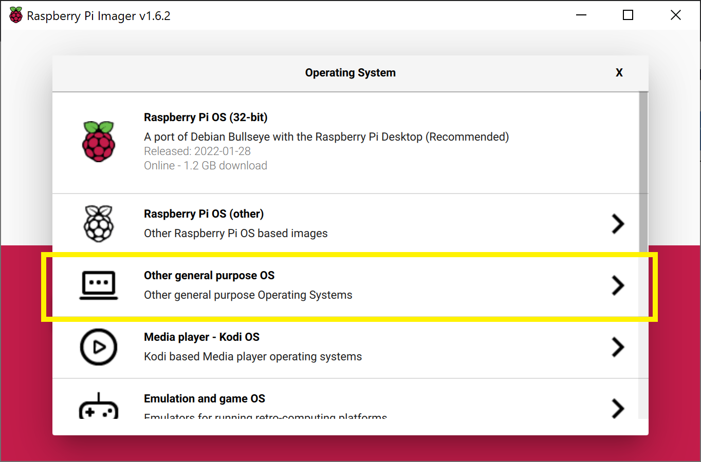
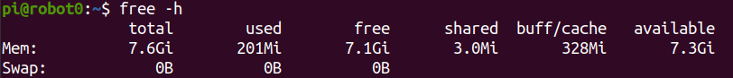
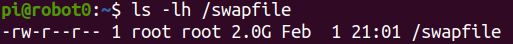
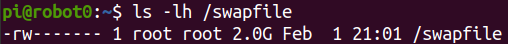
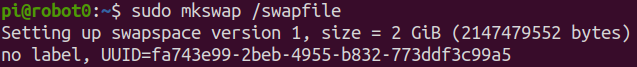
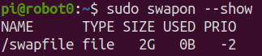
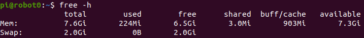
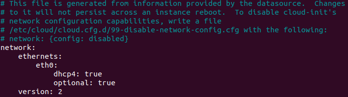

## Robot Setup
This guide will walk through the steps to install Ubuntu Server 20.04 LTS, ROS Noetic, and all dependencies on a Raspberry Pi 4 B. This Pi is then embedded within Texas Instrument's Robotics System Learning Kit MAX (TI RSLK Max) along with an RPLIDAR A1, UM7 Orientation Sensor, and a USB Camera. The robotics system, USAFABot, is utilized in the United States Air Force Academy's Electrical and Computer Engineering department to teach undergraduate students robotics. You can follow the below steps or a Raspberry Pi image can be provided by emailing [Steven Beyer](sbeyer@beyersbots.com).

---

## Hardware
Below is a list of recommended hardware and links. Other off-the-shelf components can replace the ones below. 

- [Raspberry Pi 4 Model B](https://www.canakit.com/raspberry-pi-4-8gb.html) (preferably with 8 GB of RAM))
- 128 GB High Speed MicroSD card
- MicroSD card reader
- Monitor, mouse, and keyboard
- [TI RSLK MAX Kit](https://www.ti.com/tool/TIRSLK-EVM)
- [RPLIDAR A1](https://www.slamtec.com/en/Lidar/A1)
- [UM7 Orientation Sensor](https://www.pololu.com/product/2763) and [Pololu USB AVR Programmer v2.1](https://www.pololu.com/product/3172)
- [USB Camera](https://www.adesso.com/product/cybertrack-h4-1080p-hd-usb-webcam-with-built-in-microphone/) (Any USB Cam will work, this is the one we use)
- Three short USB to micro USB cables 

### Chassis

### Camera

### Raspberry Pi

### Voltage Regulator and Power Cutoff Circuits

### LIDAR

### UM7

## Software
### Download Ubuntu and flash MicroSD card
There are multiple ways to download and install Ubuntu 20 to a MicroSD card, but the Raspberry Pi Imager is one of the easiest. Instructions for installing the imager on your operating system can be found on the [Raspberry Pi OS software page](https://www.raspberrypi.com/software/). 

Once installed, start the imager and select the "CHOOSE OS" button.


Scroll down the menu and select "Other general purpose OS".





Next, select "Ubuntu".


Lastly, scroll and select the latest 64-bit version of "Ubuntu Server 20.04 LTS".


Now that you have the correct image selected, you need to choose the correct storage device that corresponds to the MicroSD card. Select "CHOOSE STORAGE".
> ⚠️ **WARNING:** This process will overwrite the drive, so ensure you select the correct device! You can select "CHOOSE STORAGE" before inserting the MicroSD card, then insert it, and the card will be the new drive that pops up.

Once you are sure the correct drive is selected, click "WRITE".

Once complete you should have an Ubuntu SD card! Ensure your Raspberry Pi is powered off, connected to a monitor, keyboard, and mouse, and insert the SD card.

### Ubuntu Setup
#### Login and changing password
Once Ubuntu boots up you will be prompted to enter the login and password. It may take a few minutes on first boot to configure the default username and password, so if login fails, try again after a few minutes. The default username is **ubuntu** and password is **ubuntu**.

On first login, you will be prompted to change the password. Enter the current password, **ubuntu**, and then enter a new password twice.

#### Changing username (optional)
I like to change the username to "pi" so I remember that this machine is a Raspberry Pi. This is optional and you can change the username to anything you like.

First, add a *temp* user:
```bash
sudo adduser temp
```
Enter an easy to remember password, and then hit enter until you are back at the terminal prompt.

Add the *temp* user to the *sudo* group:
```bash
sudo adduser temp sudo
```

Log out of *ubuntu* user:
```bash
exit
```

Login to *temp* user account.

Change the *ubuntu* username to the new username:

```bash
sudo usermod -l newUsername ubuntu
sudo usermod -d /home/newHomeDir -m newUsername
```

For example:
```bash
sudo usermod -l pi ubuntu
sudo suermod -d /home/pi -m pi
```

Log out of *temp* user and log in with new username and password (the password is still the same as the password you set for the *ubuntu* user).

Delete the *temp* user:
```bash
sudo deluser temp
sudo rm -r /home/temp
```

Now at the terminal prompt you should see `pi@ubuntu:` and if you type `pwd` you should see `/home/pi` (with `pi` replaced with the username you chose). 

#### Change hostname
If you have multiple robots on your network it is good to give each a unique hostname. We number each robot from 0-n and each robot has a corresponding hostname (e.g., robot0).

Change the hostname with the command line editor of your choice.
```bash
sudo nano /etc/hostname
```

Replace `ubuntu` with the hostname of choice, such as robot0. Save and exit.

The new hostname will not take effect until reboot. Don't reboot yet, though! We have a couple more things to accomplish before reboot.

#### Set up Wi-Fi
Until a desktop GUI is installed we have to work with the command line to set up the Wi-Fi. This is the most reliable method I have found and we will delete these changes once a GUI is installed.

First, determine the name of your Wi-Fi network adapter by typing `ip link` (for the Raspberry Pi version of Ubuntu Server 20.04 LTS it is typically `wlan0`).


Open the `/etc/netplan/50-cloud-init.yaml` file in your favorite browser:

```bash
sudo nano /etc/netplan/50-cloud-init.yaml
```

Edit the file so it looks like the below (use spaces and not tabs) replacing **wlan0** with your wireless network interface and using your SSID and password:


Save and exit.

#### Disable Automatic Updates
Ubuntu will attempt to apply system updates in the background. This has caused issues in the past with ROS dependencies and keys. Disabling automatic updates allows you to control when Ubuntu installs updates. While this is not a good habit for general computer security, it is fine for this application of an embedded robotics system. Ensure you periodically update and upgrade your system.

Open the auto updater configuration file using sudoedit:
```bash
sudoedit /etc/apt/apt.conf.d/20auto-upgrades
```

Change the content from:
```
APT::Periodic::Update-Package-Lists "1";
APT::Periodic::Unattended-Upgrade "1";
```

to:
```
APT::Periodic::Update-Package-Lists "0";
APT::Periodic::Unattended-Upgrade "0";
APT::Periodic::AutocleanInterval "0";
APT::Periodic::Download-Upgradeable-Packages "0";
```

#### Enable SSH and generate new keys
```bash
sudo ssh-keygen -A
sudo systemctl start ssh
```

#### Add Swap Space (optional)
The Raspberry Pi 4 B used in our course has 8 GB of RAM. Swap Space might not be necessary, but with a larger SD card it is beneficial.

You can check that there is no active swap using the free utility:





The **fallocate** program can be used to create a swap:

```bash
sudo fallocate -l 2G /swapfile
```

If it was created correctly, you should see the below:





Make the file only accessible to root by typing:

```bash
sudo chmod 600 /swapfile
```

Verify the permissions by typing the following:





Now only root user has read and write flags enabled.

You can set the file as swap space by typing the following:





Then turn on the swap file:

```bash
sudo swapon /swapfile
```

To verify that this worked you can type the following:





This swap will only last until reboot, so to make it permanent at it to the `fstab` file:
```bash
echo '/swapfile none swap sw 0 0' | sudo tee -a /etc/fstab
```

Now it is time to reboot by typing `sudo reboot`!

#### Verify changes
After reboot and you log in your new hostname should be listed at the terminal (e.g., `pi@robot0`). Additionally, you should be connected to Wi-Fi and have an IP Address. You can confirm by typing the following and observing the IP address in the output:


You can now use this IP address to create a remote secure shell into the USAFABot using either the IP address or hostname if your network provides Dynamic DNS. From another machine connected to your network type one of the following:

```bash
ssh username@IP_ADDRESS
```
or
```bash
ssh username@HOSTNAME
```

Lastly, ensure your swap space is still active by typing the following and observing the output:





#### Update and Upgrade
Since we turned off automatic updates, you should periodically update and upgrade. You can use this single command to accomplish both while accepting all upgrades:

```bash
sudo apt update && sudo apt -y upgrade
```

#### Install Ubuntu Desktop (optional)
A desktop GUI is not necessary for a remote machine like the USAFABot and will take up about 1.4 GB of RAM to run. I include directions for installing the Ubuntu GNOME 3 desktop environment for completeness and flexibility. The following will install the environment while confirming the installation:

```bash
sudo apt -y install ubuntu-desktop
```

#### Ubuntu Desktop Network Settings
If you do install the Ubuntu Desktop and want to use the GUI to setup the Wi-Fi network then you need to remove the settings included in the `/etc/netplan/50-cloud-init.yaml` file. It should look like the original file when complete:





You can now use the GUI interface in the top right of the screen to set up a Wi-Fi connection.

#### Setup GitHub SSH Keys
The following assumes you already have a GitHub account.

Create SSH keys to use with your GitHub account by typing the following using the same email as you GitHub login:

```bash
cd
ssh-keygen -t ed25519 -C "github@email.com"
```

When prompted to "Enter a file in which to save the key", hit **enter**.

At the prompt, type a secure password.

Start the ssh-agent in the background and add your SSH private key to the ssh-agent:

```bash
eval "$(ssh-agent -s)"
ssh-add ~/.ssh/id_ed25519
```

Open the public key with your favorite command line editor (this is easier to accomplish via an SSH connection from a desktop machine with a GUI so you can copy the public key to your GitHub account).

```bash
nano ~/.ssh/id_ed25519.pub
```

Copy the contents of the file (maximize the window and ensure you copy the entire contents up to the GitHub email).

Open a web browser and sign in to your GitHub account.

In the upper-right corner of any page, click your profile photo, then click **Settings**:


In the user settings sidebar, click **SSH and GPG keys**:


Click **New SSH key**:


In the "Title" field, add a descriptive label for the new key, such as "robot0".

Paste your key into the "Key" field (contents of the `.pub` file).

Click **Add SSH key**.

#### Update Alternatives
Python3 is installed in Ubuntu20 by default. Some ROS packages utilize the "python" command instead of "python3" so we need to create a new executable, "/usr/bin/python" that will call the Python3 (basically use the command "python" to call Python3):

```bash
sudo update-alternatives --install /usr/bin/python oython /usr/bin/python3 10
```

### ROS Noetic
At this point, the Ubuntu environment is setup. Now we will setup the ROS requirements for the USAFABot. All of these instructions are adapted from the [ROS wiki](http://wiki.ros.org/noetic/Installation/Ubuntu). ROS Noetic is the latest version of ROS 1 that supports Ubuntu Focal.

#### Installation
Accept software from packages.ros.org:

```bash
sudo sh -c 'echo "deb http://packages.ros.org/ros/ubuntu $(lsb_release -sc) main" > /etc/apt/sources.list.d/ros-latest.list'
```

Set up keys:

```bash
sudo apt install curl # if you haven't already installed curl
curl -s https://raw.githubusercontent.com/ros/rosdistro/master/ros.asc | sudo apt-key add -
```

Install ROS Noetic:

```bash
sudo apt update
sudo apt -y install ros-noetic-ros-base
```

The base version provides the Bare Bones of ROS to include minimum packaging, build, and communications libraries. No GUI tools are installed. As the Raspberry Pi is embedded into the USAFABot it is ideal to keep overhead as low as possible. Many of the GUI tools will be ran on the main machine.

Install ROS dependencies for building packages:

```bash
sudo apt install python3-rosdep python3-rosinstall python3-rosinstall-generator python3-wstool build-essential python3-pip
```

Initialize rosdep

```bash
sudo rosdep init
rosdep update
```

Source the ROS setup file:
```bash
source /opt/ros/noetic/setup.bash
```

Create your ROS workspace:

```bash
mkdir -p ~/catkin_ws/src
cd ~/catkin_ws/
catkin_make
```

Setup ROS environment variables and setup scripts within the `~/.bashrc` file. Open the `~/.bashrc` file with your favorite command line editor and add the following to the bottom:

```bash
source /opt/ros/noetic/setup.bash
source ~/catkin_ws/devel/setup.bash
export ROS_PACKAGE_PATH=~/catkin_ws/src:/opt/ros/noetic/share
export ROS_HOSTNAME=`hostname` # note these are backticks, not apostrophes
export ROS_MASTER_URI=http://MASTER_IP:11311 # replace "MASTER_IP" with IP address/hostname of your master
```

Any time you make changes to your `~/.bashrc` file you must source it:

```bash
source ~/.bashrc
```

#### Dependencies
There are a number of ROS packages required to operate the USAFABot. Some of these can be installed using `apt install` and others have to be installed from source. Change directories to your source folder and follow the below steps to install each dependency.

```bash
cd ~/catkin_ws/src
```

##### [RPLIDAR](http://wiki.ros.org/rplidar)
```bash
git clone https://github.com/Slamtec/rplidar_ros
```

##### [Serial](http://wjwwood.io/serial/)
```bash
git clone https://github.com/wjwwood/serial
```

##### [UM7](http://wiki.ros.org/um7)
```bash
git clone https://github.com/ros-drivers/um7
```

##### USAFABot
```bash
git clone git@github.com:AF-ROBOTICS/usafabot.git
```

The **usafabot_curriculum** package includes all dependencies needed to run the USAFABot nodes. We can automatically install these dependencies using the ROSDEP tool:

```bash
cd ~/catkin_ws
rosdep install --from-paths src --ignore-src -r -y
```

This will take a while.

Now we can make and source our workspace:

```bash
cd ~/catkin_ws
catkin_make
source ~/.bashrc
```

The last set of dependencies we need to install are Python dependencies. These are listed within our **usafabot_curriculum** package and can be installed using the `pip3` tool:

```bash
roscd usafabot_curriculum
pip3 install -r requirements.txt
```

> 📝️ **Note**: the "dlib" package will take quite a while to install.

### TI-RSLK MAX Software
The last software install necessary is to flash the MSP-432 Microcontroller on the TI-RSLK MAX. This is easiest done using Texas Instrument's Code Composer Studio software. 